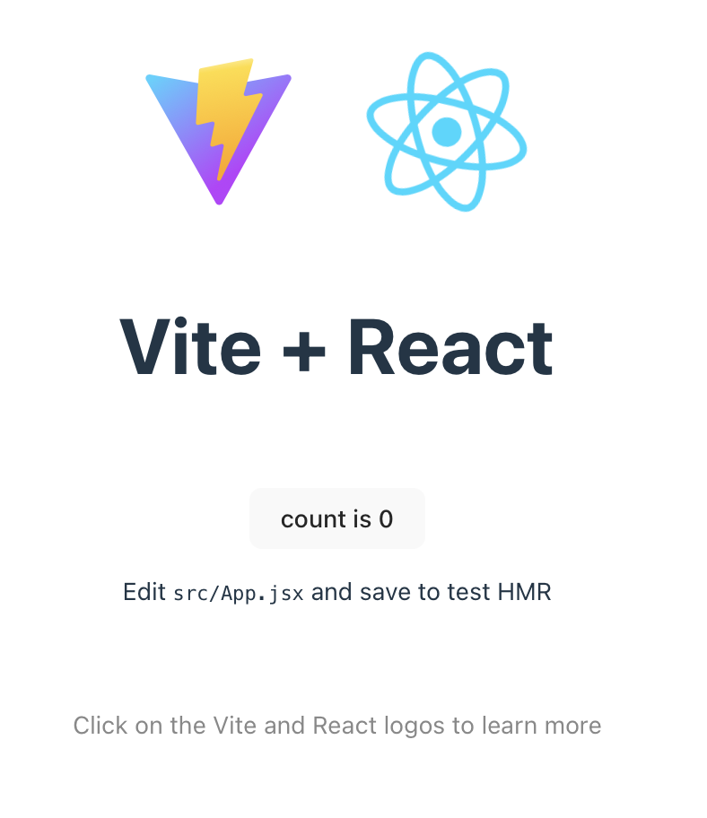
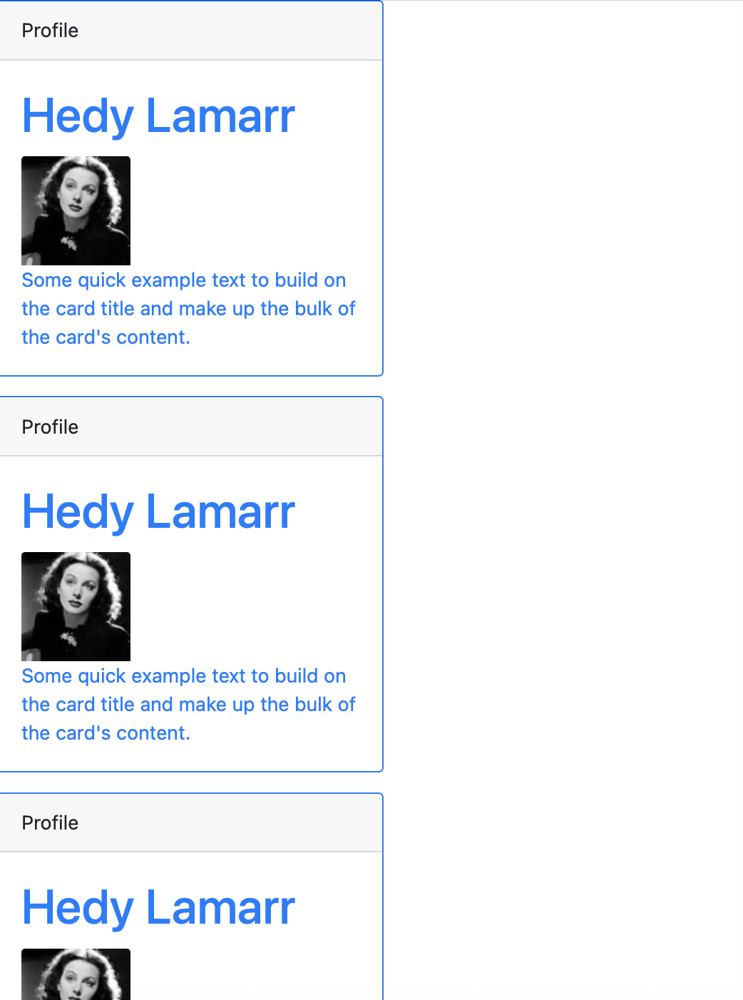

# intro-react

Repository for learning about React and building websites with React

In December 2025, Nick started to learn React using the lessons and tutorials from [W3Scools](https://www.w3schools.com/react/react_intro.asp).

## my-react-app

1.  Install Node.js. You can find [instructions on the Node.js website](https://nodejs.org/en/download). For Mac:

    ``` bash
    # Download and install nvm:
    curl -o- https://raw.githubusercontent.com/nvm-sh/nvm/v0.40.3/install.sh | bash

    # in lieu of restarting the shell
    \. "$HOME/.nvm/nvm.sh"

    # Download and install Node.js:
    nvm install 24

    # Verify the Node.js version:
    node -v # Should print "v24.12.0".

    # Verify npm version:
    npm -v # Should print "11.6.2".
    ```

2.  Choose a build tool such as Vitae

    ``` bash
    npm install -g create-vite
    ```

3.  Create React template. Type y to confirm options.

``` bash
npm create vite@latest my-react-app -- --template react
```

=\> go to <http://localhost:5173/> in the browser and there it is. Or start it yourself by typing `npm run dev` in the folder *my-react-app*



## hello-world

I created a new folder `hello-world` and copied minimum needed files from `my-react-app` to just show Hello World! Run `npm install` to  include dependencies.


## my-profile

I created a new app with `npx create-react-app@latest my-profile` (Documented at the [React website](https://create-react-app.dev/docs/getting-started/)).

Using bootstrap classes [as shown on the website](https://getbootstrap.com/docs/4.0/getting-started/introduction/), I show a modified example from the [React learn page](https://react.dev/learn).

